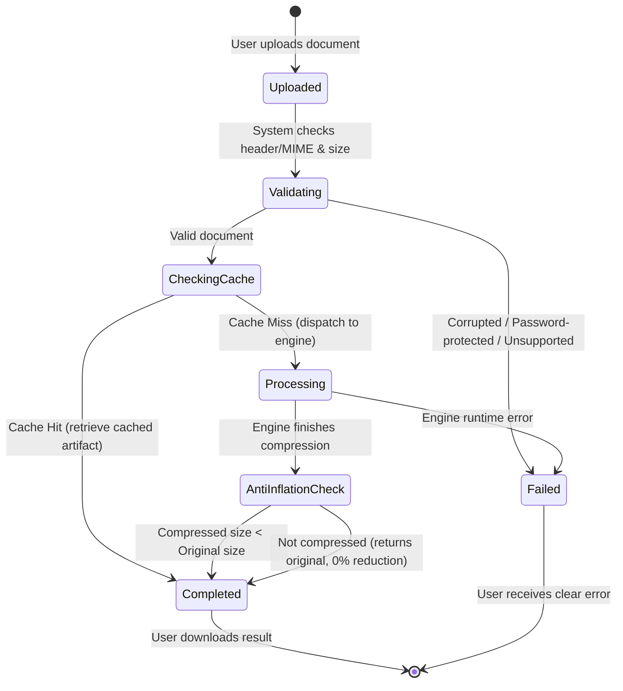

# Data Model & Schema: Document Compression

**Feature**: Document Compression for PDF and Word Files (`001-compress-documents`)  
**Date**: 2026-09-17  
**Status**: Ratified

---

## 1. Domain Entities & Value Objects

### 1.1 Document
Represents an input file submitted for compression.

| Field | Type | Description | Validation / Constraints |
| :--- | :--- | :--- | :--- |
| `id` | `string` (UUID v4) | Unique identifier for the document instance | Non-empty, valid UUID |
| `fileName` | `string` | Original filename as provided by user | Max 255 chars, sanitized |
| `format` | `DocumentFormat` | Enumerated document type | `'pdf' \| 'docx' \| 'doc'` |
| `originalSize` | `number` | File size in bytes | $> 0$ and $\le 104,857,600$ (100MB) |
| `mimeType` | `string` | Detected MIME type | Must match recognized format signature |
| `contentHash` | `string` | SHA-256 hash of the raw file buffer | Exactly 64 hexadecimal characters |
| `createdAt` | `Date` | Timestamp of upload | ISO 8601 |

### 1.2 CompressionProfile (Value Object)
Defines optimization parameters applied during processing.

| Profile Name | Target Use Case | PDF Settings | DOCX Media Settings | XML Deflate Level |
| :--- | :--- | :--- | :--- | :--- |
| `recommended` | Everyday sharing, email | Ghostscript `/ebook` (150 DPI) | Sharp JPEG quality 80, PNG palette | 9 (Maximum) |
| `maximum` | Tight upload/size limits | Ghostscript `/screen` (72 DPI) | Sharp JPEG quality 65, downscale $>1200\text{px}$ | 9 (Maximum) |
| `high_fidelity` | Archival, print preservation | Ghostscript `/prepress` (300 DPI) | Sharp JPEG quality 90 (lossless pass) | 9 (Maximum) |

### 1.3 CompressionJob
Represents an active lifecycle execution of a document compression task.

| Field | Type | Description |
| :--- | :--- | :--- |
| `id` | `string` (UUID v4) | Job identifier |
| `documentId` | `string` | Associated document ID |
| `profile` | `CompressionProfileName` | Chosen profile (`recommended`, `maximum`, `high_fidelity`) |
| `status` | `JobStatus` | `'pending' \| 'processing' \| 'completed' \| 'failed'` |
| `progress` | `number` | Integer progress percentage (0 to 100) |
| `cached` | `boolean` | `true` if satisfied via deduplication cache |
| `error` | `string \| null` | Error description if status is `'failed'` |
| `startedAt` | `Date` | Timestamp when job started processing |
| `completedAt` | `Date \| null` | Timestamp when job reached terminal state |

### 1.4 CompressionResult
Output metrics and artifact references returned to the user.

| Field | Type | Description | Validation |
| :--- | :--- | :--- | :--- |
| `jobId` | `string` | Reference to the originating job | Valid UUID |
| `originalSize` | `number` | Pre-compression byte size | $> 0$ |
| `compressedSize` | `number` | Post-compression byte size | $> 0$, $\le \text{originalSize}$ |
| `bytesSaved` | `number` | Difference in bytes ($\text{original} - \text{compressed}$) | $\ge 0$ |
| `reductionPercentage` | `number` | Percentage reduction ($(\text{saved} / \text{original}) \times 100$) | Range: $0.00$ to $99.99$ |
| `downloadUrl` | `string` | Local stream URL for downloading compressed document | Relative endpoint |
| `executionDurationMs`| `number` | Total processing time in milliseconds | $\ge 0$ |

---

## 2. Database Schema (SQLite Cache & Deduplication)

### Table: `compression_cache`
Stores records of previously processed files to prevent redundant computation.

```sql
CREATE TABLE IF NOT EXISTS compression_cache (
    id TEXT PRIMARY KEY NOT NULL,
    content_hash TEXT NOT NULL,
    profile TEXT NOT NULL,
    file_format TEXT NOT NULL,
    original_name TEXT NOT NULL,
    original_size INTEGER NOT NULL,
    compressed_size INTEGER NOT NULL,
    bytes_saved INTEGER NOT NULL,
    reduction_percentage REAL NOT NULL,
    storage_path TEXT NOT NULL,
    hit_count INTEGER NOT NULL DEFAULT 1,
    created_at INTEGER NOT NULL,
    last_accessed_at INTEGER NOT NULL,
    CONSTRAINT uq_hash_profile UNIQUE (content_hash, profile)
);

CREATE INDEX IF NOT EXISTS idx_cache_hash_profile ON compression_cache(content_hash, profile);
CREATE INDEX IF NOT EXISTS idx_cache_last_accessed ON compression_cache(last_accessed_at);
```

---

## 3. State Transitions (Compression Lifecycle)


